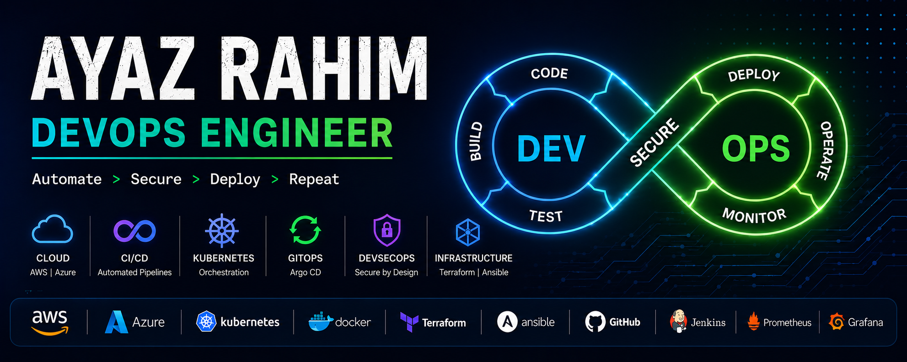

<h1 align="center">Hi 👋, I'm Ayaz Rahim</h1>

<h3 align="center">
DevOps Engineer | Cloud Infrastructure, Automation, CI/CD & DevSecOps | Kubernetes | AWS | Azure | Terraform | GitOps
</h3>  

Building secure, scalable, and cloud-native platforms through automation, GitOps, and modern DevSecOps practices.

  

---

## 🚀 About Me

* 🔭 DevOps Engineer with 3+ years of experience
* ☁️ Designing and managing cloud infrastructure on AWS & Azure
* 🚢 Managing Kubernetes clusters (EKS, AKS, Kubeadm)
* ⚙️ Automating infrastructure using Terraform & Ansible
* 🔄 Implementing GitOps workflows using Argo CD
* 🔐 Working on DevSecOps practices and secure software delivery
* 📊 Building observability platforms using Prometheus & Grafana
* 🐧 Linux System Administration & Performance Optimization
* 🛡️ Implementing IAM, RBAC, Secrets Management, and TLS Automation
* 🚀 Passionate about Platform Engineering and Cloud Security

---

## 🛠️ Technologies & Tools

  

---

## 🔐 DevSecOps & Security

* Secure CI/CD Pipelines
* GitHub Actions Security
* SonarQube Code Quality & Security
* Trivy Container Image Scanning
* Kubernetes RBAC & Security Hardening
* IAM & Least Privilege Access Control
* Secrets Management
* TLS & Certificate Automation
* DevSecOps Best Practices
* Infrastructure Security & Compliance

---

## 🎯 Current Focus

* DevSecOps
* Platform Engineering
* Kubernetes Security
* GitOps Automation
* Multi-Cloud Infrastructure
* Cloud Security
* Production Observability
* Infrastructure Automation

---

## 🚀 Featured Projects

| Project                      | Description                                    |
| ---------------------------- | ---------------------------------------------- |
| Terraform AWS Infrastructure | Infrastructure provisioning using Terraform    |
| Production EKS Platform      | Kubernetes workloads running on AWS EKS        |
| Azure AKS GitOps             | AKS deployment using Argo CD                   |
| GitHub Actions CI/CD         | Automated build, test and deployment pipelines |
| DevSecOps Lab                | Security Scanning & Secure CI/CD               |
| Monitoring Stack             | Prometheus, Grafana & Alerting                 |
| Kubernetes Production Setup  | Highly Available Kubernetes Architecture       |

---

## 📈 GitHub Statistics

  

  

  

---

## 📊 Contribution Graph

---

## 📚 Certifications & Continuous Learning

* Certified Kubernetes Administrator (CKA) — In Progress
* AWS Certified Solutions Architect Associate — In Progress
* Terraform Associate — Learning
* DevSecOps for Kubernetes
* Container Security & Supply Chain Security
* Platform Engineering
* Cloud Native Security

---

## 🤝 Connect With Me

---

## ⚡ Engineering Philosophy

> Great platforms are not measured by how often they need attention, but by how reliably they operate without it.
>
> My focus is on building automated, secure, and observable infrastructure that enables teams to innovate faster while ensuring business continuity, operational stability, and long-term scalability.
>
> Every deployment should be repeatable.
>
> Every system should be monitored.
>
> Every security control should be intentional.
>
> Every manual task should be a candidate for automation.
>
> I believe that strong engineering practices, DevSecOps culture, and platform reliability are key to reducing operational risk, accelerating delivery, and supporting sustainable business growth.

---

⭐ If you find my repositories useful, feel free to star them and connect with me.
